# Certificates & Courses

> 🔗 [Back to main profile](../README.md)

---

## 🎓 Codecademy

### Data Scientist — Machine Learning Specialist *(Professional Certification)*
**January 14, 2025** · Certificate ID: A54071E5-C

Passed 6 exams: Data Science Foundations I & II, Machine Learning Foundations, ML I, ML II, ML III.
Technologies: SQL, Python, pandas, scikit-learn, data cleaning, hypothesis testing, statistics, data visualization, machine learning, neural networks.

`git` `sql` `python` `statistics` `statistical tests` `pandas` `matplotlib` `seaborn` `scikit-learn` `machine learning` `deep learning`

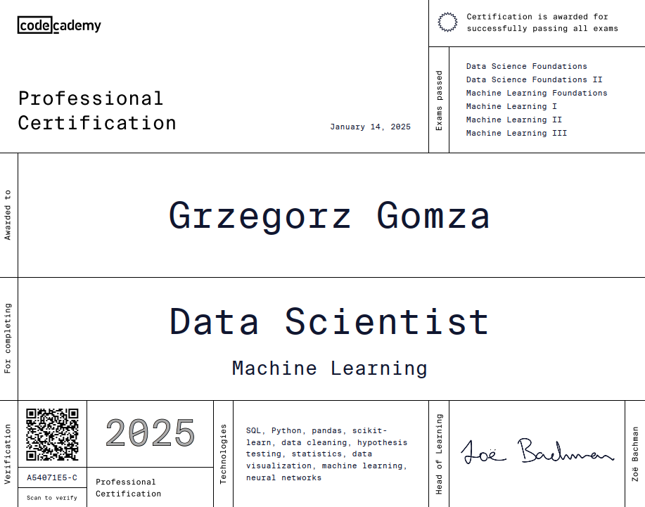

---

### Python for Data Science: Working with Data
**December 18, 2023 - July 28, 2024** · Certificate ID: 6580756DBF
Created 4 Implementations and Presentations for the main Blocks:
- Databases - Data Analysis with PostgreSQL
- Python - Exploratory Data Analysis
- Machine Learning - Analysing Churn Problem
- Deep Learning - CNN for 
`git` `sql` `python` `statistics` `statistical tests` `pandas` `matplotlib` `seaborn` `scikit-learn` `machine learning` `deep learning` `tensorflow`

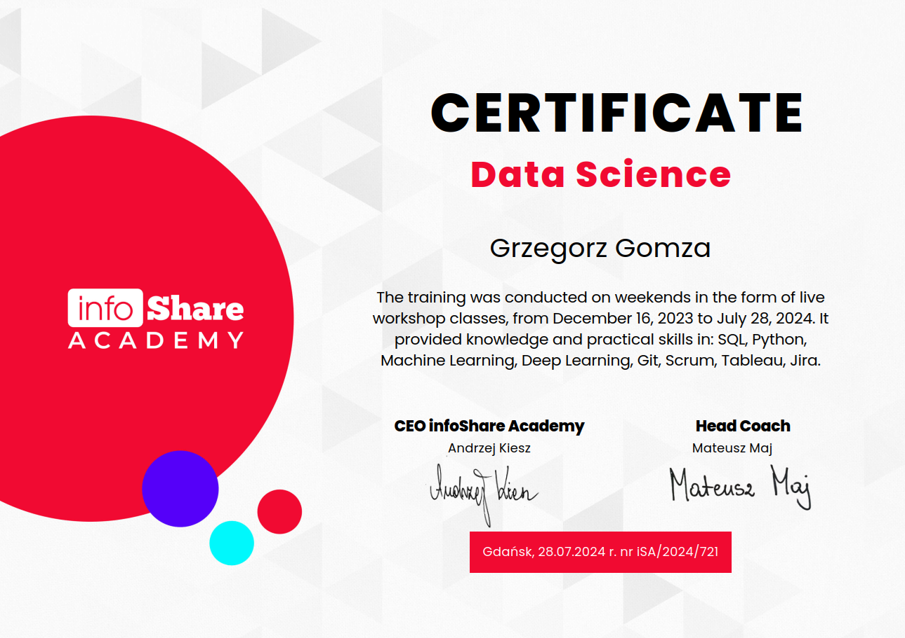

---

### Intro to Cloud Computing Course
**January 10, 2025** · Certificate ID: 2155AB1A-3

`Cloud Computing` `Computer Science`

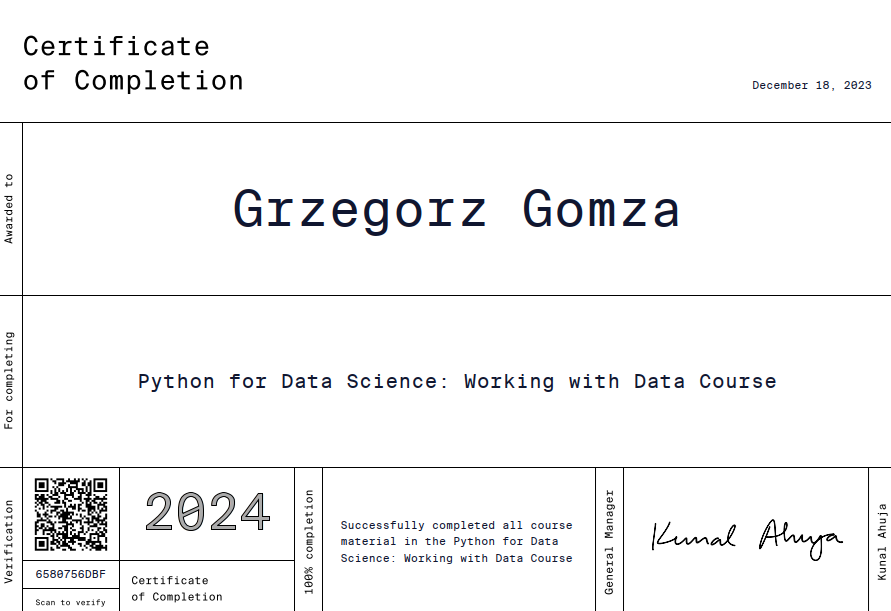

---

### Introduction to Big Data with PySpark Course
**January 28, 2025** · Certificate ID: 5ED02B7B-A

`PySpark` `Big Data` `Cloud Computing` `Computer Science`

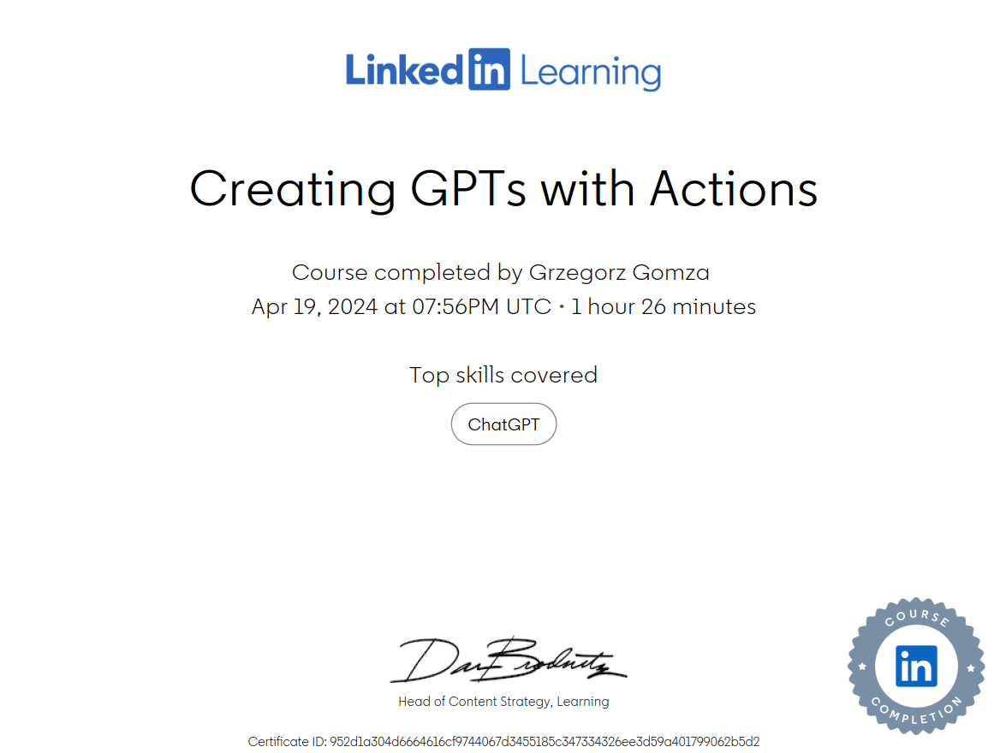

---

### Learn C++ Course
**January 19, 2025** · Certificate ID: 842D3DDA-6

`C++`

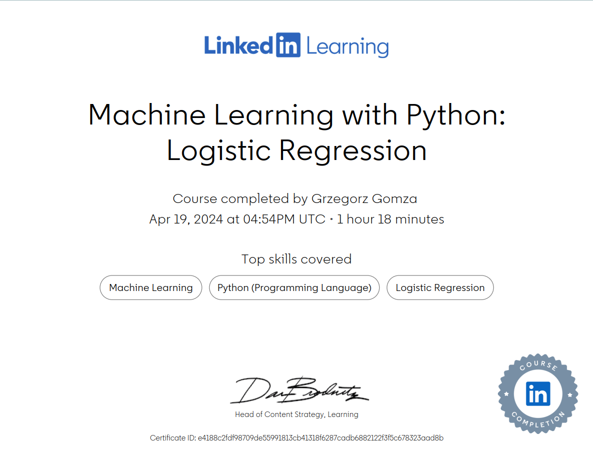

---

### Learn SQL Course
**December 19, 2023** · Certificate ID: 65817F6BCF

`SQL`

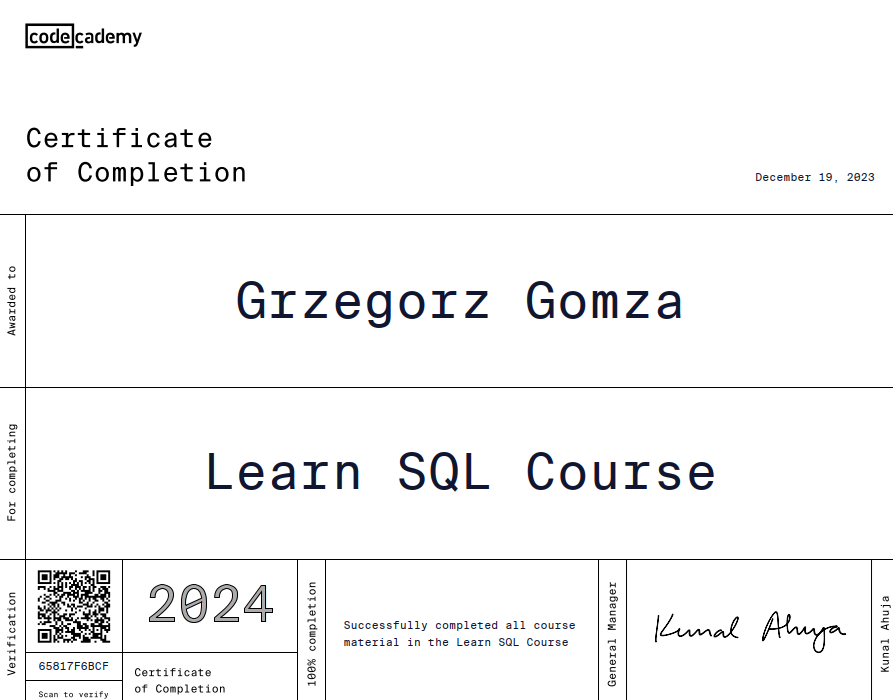

---

## 🔗 LinkedIn Learning

### Machine Learning with Python: Logistic Regression
**April 19, 2024** · 1 hr 18 min · Certificate ID: e4188c2fdf98709de55991813cb41318f6287cadb6882122f3f5c678323aad8b

`Machine Learning` `Python` `Logistic Regression`

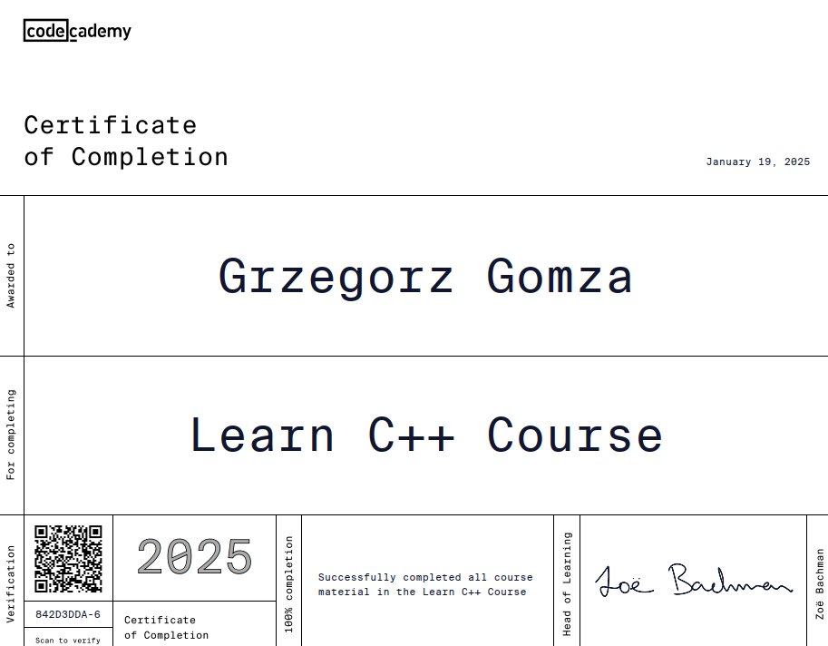

---

### Creating GPTs with Actions
**April 19, 2024** · 1 hr 26 min · Certificate ID: 952d1a304d6664616cf9744067d3455185c347334326ee3d59a401799062b5d2

`ChatGPT`

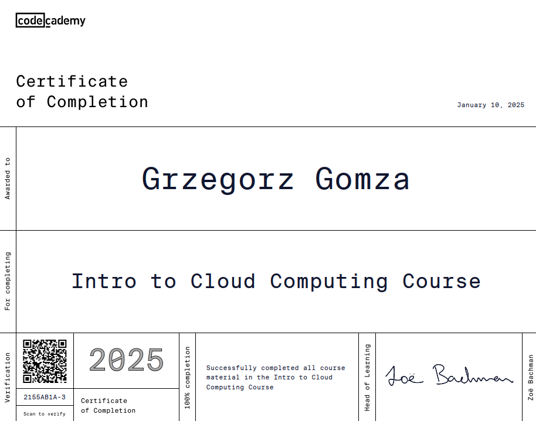

---

## 🏫 InfoShare Academy

### Data Science Bootcamp *(370 hrs)*
**Gdańsk, July 28, 2024** · Certificate nr iSA/2024/721

Live weekend workshops from December 16, 2023 to July 28, 2024.
Skills: SQL, Python, Machine Learning, Deep Learning, Git, Scrum, Tableau, Jira.

`git` `sql` `python` `statistics` `tableau` `pandas` `numpy` `matplotlib` `seaborn` `scikit-learn` `machine learning` `reinforcement learning` `deep learning`

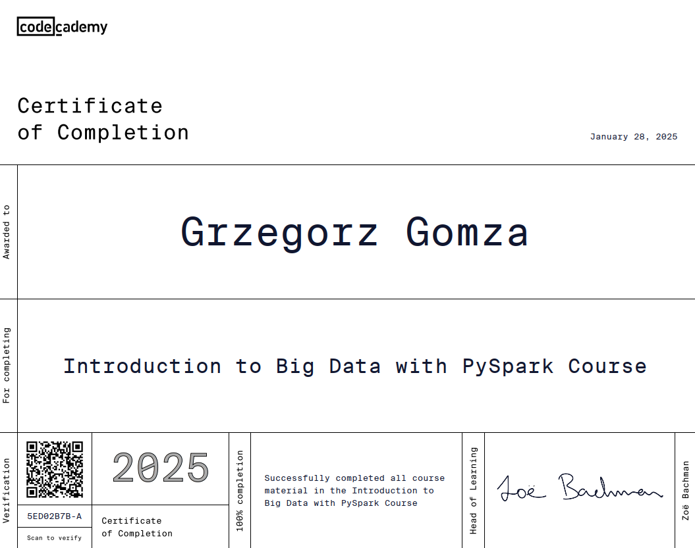

---

## 🗃️ Neo4j GraphAcademy

### Neo4j Fundamentals
**January 29, 2025** · Certificate ID: 0a50d079-a74a-4e7f-9b75-4bdc99f88264

Learn about Graph databases and get started with Neo4j.

`Neo4j` `Cypher Query Language`

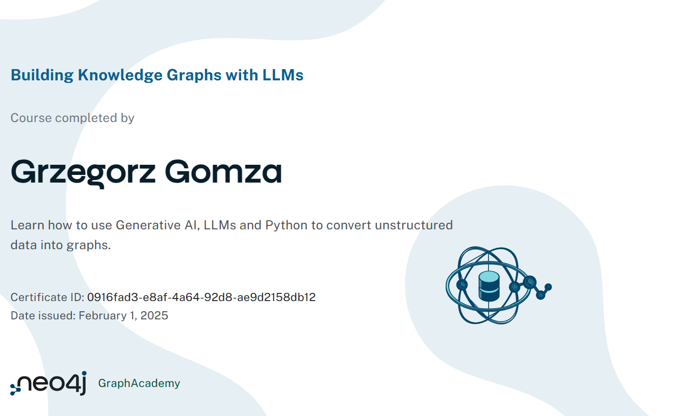

---

### Cypher Fundamentals
**January 29, 2025** · Certificate ID: 0eebd937-6ff2-4e3e-be22-3d16c3974a8a

Learn Cypher in 1 hour.

`Neo4j` `Cypher Query Language`

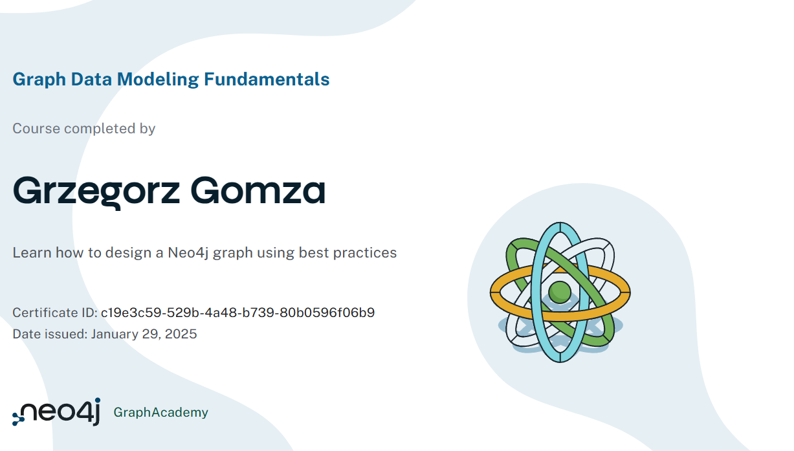

---

### Graph Data Modeling Fundamentals
**January 29, 2025** · Certificate ID: c19e3c59-529b-4a48-b739-80b0596f06b9

Learn how to design a Neo4j graph using best practices.

`Neo4j` `Cypher Query Language`

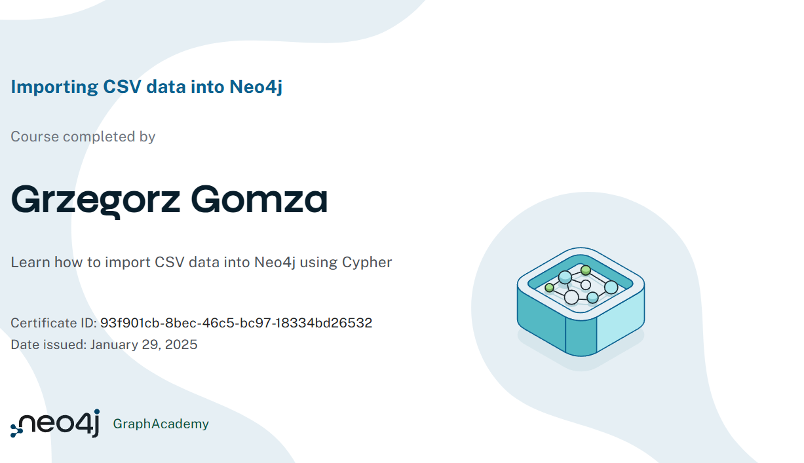

---

### Importing Data Fundamentals
**January 29, 2025** · Certificate ID: f417eefc-f143-4747-81ac-838d3c2fb001

Learn how to import data into Neo4j.

`Neo4j` `Cypher Query Language`

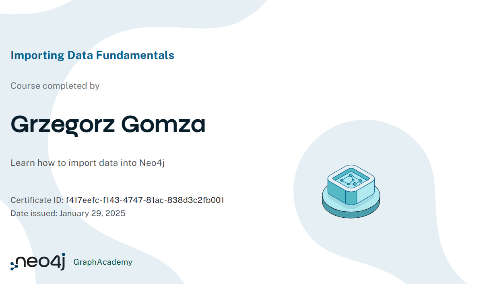

---

### Importing CSV Data into Neo4j
**January 29, 2025** · Certificate ID: 93f901cb-8bec-46c5-bc97-18334bd26532

Learn how to import CSV data into Neo4j using Cypher.

`Neo4j` `Cypher Query Language`

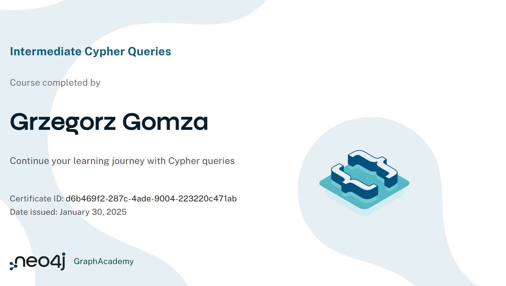

---

### Intermediate Cypher Queries
**January 30, 2025** · Certificate ID: d6b469f2-287c-4ade-9004-223220c471ab

Continue your learning journey with Cypher queries.

`Neo4j` `Cypher Query Language`

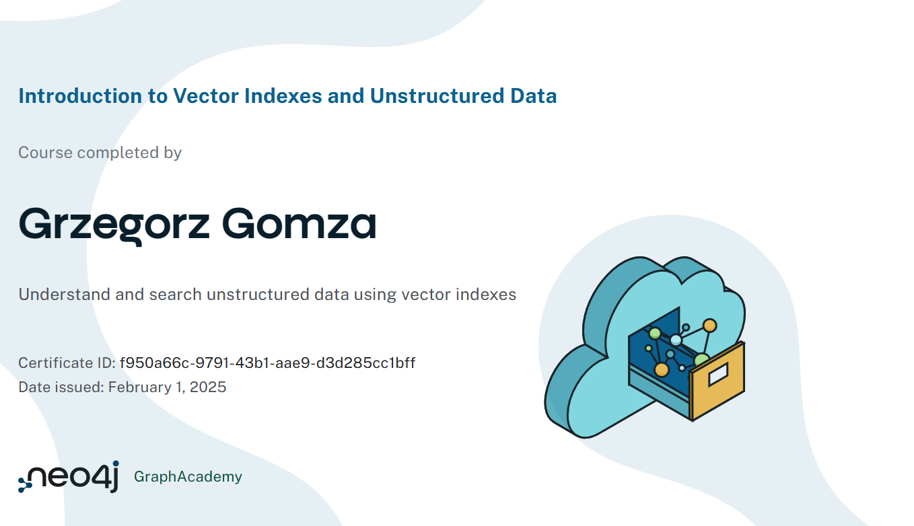

---

### Neo4j & LLM Fundamentals
**January 31, 2025** · Certificate ID: 43f14bdf-e38e-49ae-95ed-4595105796a3

Learn how to use Neo4j with Large Language Models.

`Neo4j` `Cypher Query Language` `LangChain` `OpenAI API`

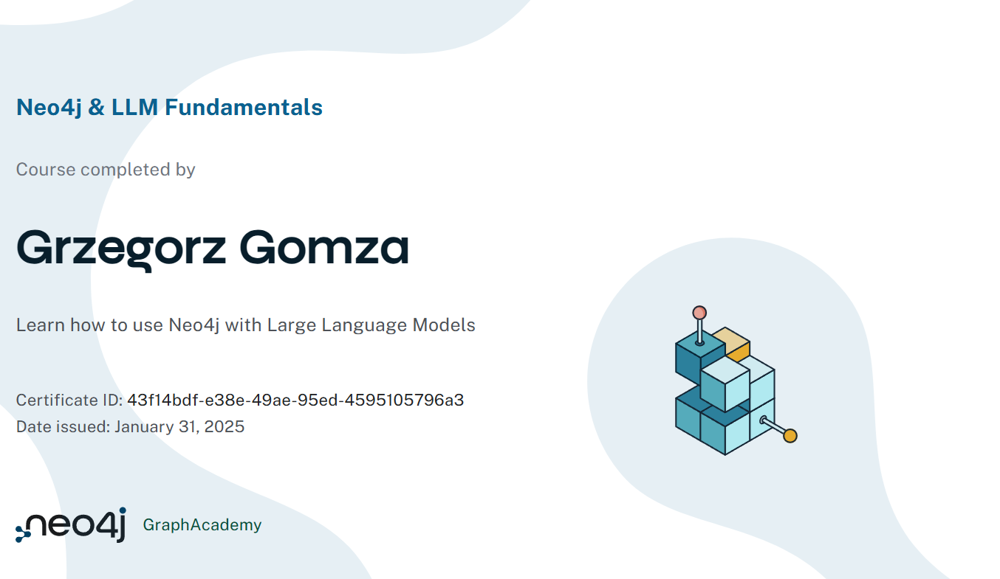

---

### Build a Neo4j-backed Chatbot using Python
**February 1, 2025** · Certificate ID: 988e979c-31d3-4038-9289-1af08950c98b

Build a chatbot using Neo4j, LangChain and Streamlit.

`Neo4j` `Cypher Query Language` `LangChain` `OpenAI API`

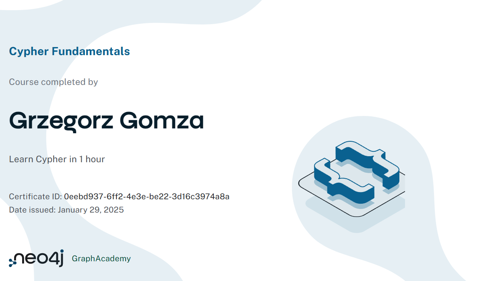

---

### Introduction to Vector Indexes and Unstructured Data
**February 1, 2025** · Certificate ID: f950a66c-9791-43b1-aae9-d3d285cc1bff

Understand and search unstructured data using vector indexes.

`Neo4j` `Cypher Query Language` `LangChain` `OpenAI API`

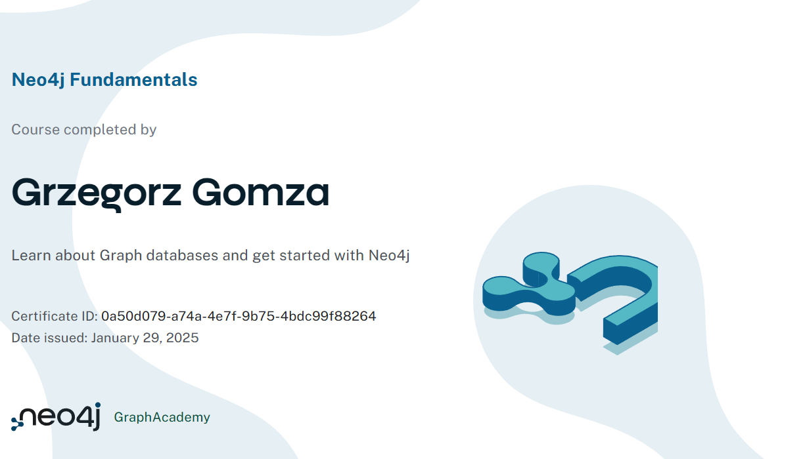

---

### Building Knowledge Graphs with LLMs
**February 1, 2025** · Certificate ID: 0916fad3-e8af-4a64-92d8-ae9d2158db12

Learn how to use Generative AI, LLMs and Python to convert unstructured data into graphs.

`Neo4j` `Cypher Query Language` `LangChain` `OpenAI API`

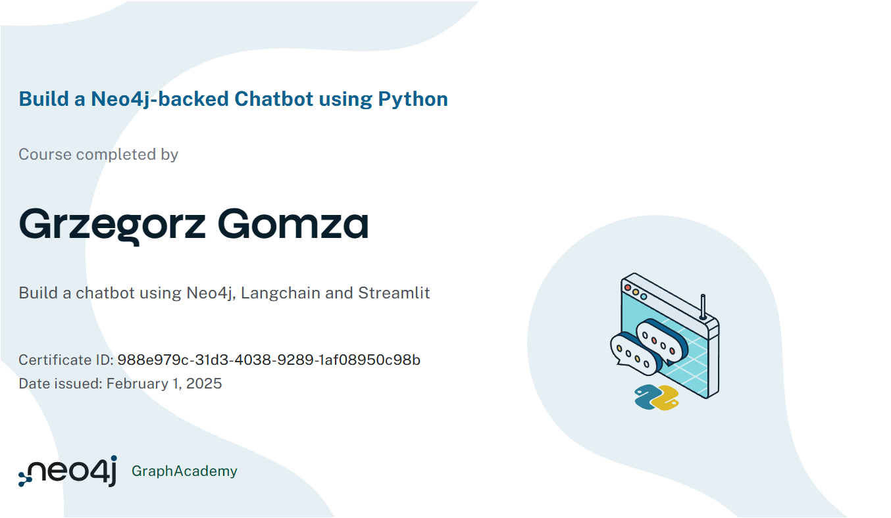

---

*🔗 [Back to main profile](../README.md) · [Projects](PROJECTS.md) · [Experience](EXPERIENCE.md)*
